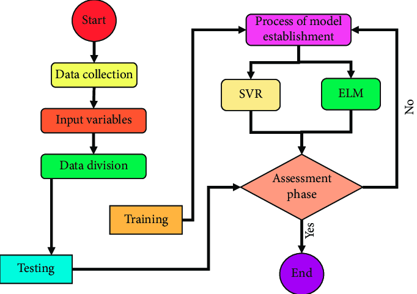
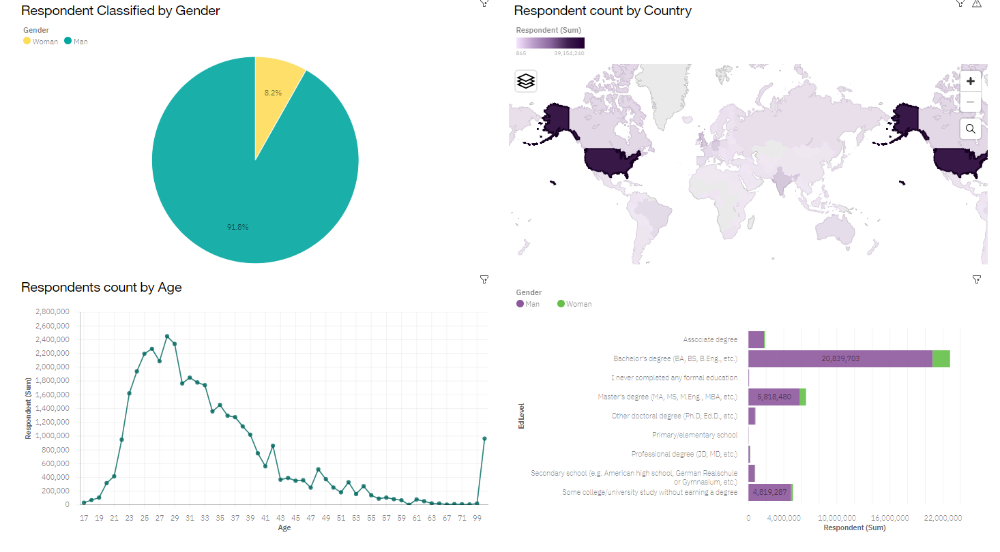

# Data Analysis Portfolio
## [Prediction Model](https://github.com/Nas-git-hub/Prediction-model.git)
A machine learning model that is trained to accept data and predict future values of that data with minimal prediction error. 

*	Downloaded weather data from [Historical Hourly Weather Data 2012-2017 | Kaggle](https://www.kaggle.com/datasets/selfishgene/historical-hourly-weather-data) and saved locally as csv file
*	Used python in data cleaning proceedure (ie removed unwanted colums, dropped empty rows, removed duplicates and standardized outliners)
*	Read the data in excel using only the temperature and hour parameters and I indexed the hour column
*	I plot the temperature to time graph using the first half of the dataset
*	Using sqlearn library and the arima model I developed a training algorythm using the initial first half of the data set to train and predict the second half 
*	The model responded with numerous running with a minimal rms.

  _Project Report included in project directory_

### Over view of the Arima Model architecture 

## [Analyzing data with python visualizations](https://github.com/Nas-git-hub/Analyzing-Automobile-sales.git)  
* Downloaded an already cleaned dataset which was artificially created for the purpose of 
  the project.
* Developed a Line chart using the functionality of pandas to show how automobile sales 
  fluctuate from year to year.
* Plot different lines for categories of vehicle type and analyse the trend to find out if there
  is a noticeable difference in sales trends between different vehicle types during recession periods.
* Used the functionality of Seaborn Library and pandas to create a visualizations to compare the sales 
  trend in various periods to gain insights to data.

  _Project Report included in project directory_

## [Data Dashboarding with Dash and Plotly](https://github.com/Nas-git-hub/Dashboard-with-Dash-and-Plotly.git) 
This dashboard is to explore patterns and trends to gain insight on behaviors of wildfires per year in regions in Australia. 
 * Used plotly and dash framework to develop an interactive web dashboard for visualization
   
### Image view of the dashboard  

## [Analysing the demand for various tech Stack](https://github.com/Nas-git-hub/Tech-Stack-Data-Analysis.git) 
This project involves analyzing trending tech stack as a Data analyst of a global IT and business consulting service firm 
and with changing technologies there is a requirement to do regular analysis to help identify future skill requirements.

* Collected data on the top programming skills from sources like Job postings, Training portals and Surveys using webscrapping.
* Found and removed duplicates
* Inputing and removing missing values
* Normalized the data  
* Used appropriate visualizations to reveal findings to questions
* Created an interactive dashboard to report findings 
_Project report included in project repository_

[Dashboard of current tech stack trends]( https://dataplatform.cloud.ibm.com/dashboards/bd8d4a0c-0aaa-426c-9d21-2ff6ac90e236/view/5826d6161ebc19926df2f2e4079f28547f34275ee7bbd105d4837b490e662597f03b4696c8284309da195062a5e5135acf)

[Dashboard of future tech stack trends](https://dataplatform.cloud.ibm.com/dashboards/809d3c2e-b324-4133-bf40-d74982bb5120/view/523ed90624800bd454ddeae4079f28547f34275ee7bbd105d4837b490e662597f03b4696c8284309da195062a5e5135acf)

[Demographics dashboard](https://dataplatform.cloud.ibm.com/dashboards/65195174-c62b-4a3c-b177-c1666e4d451b/view/6266f73838836dc957ebf6e4079f28547f34275ee7bbd105d4837b490e662597f03b4696c8284309da195062a5e5135acf)

### An overview of the survey demograpics of data collected 
